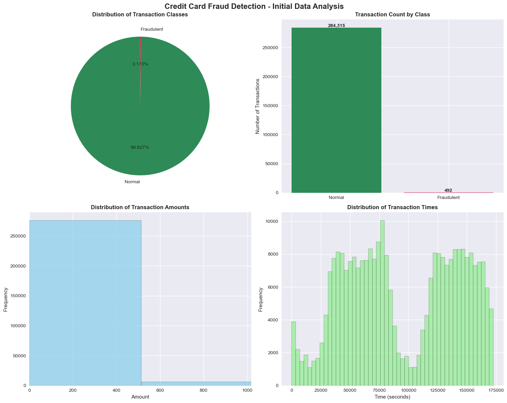
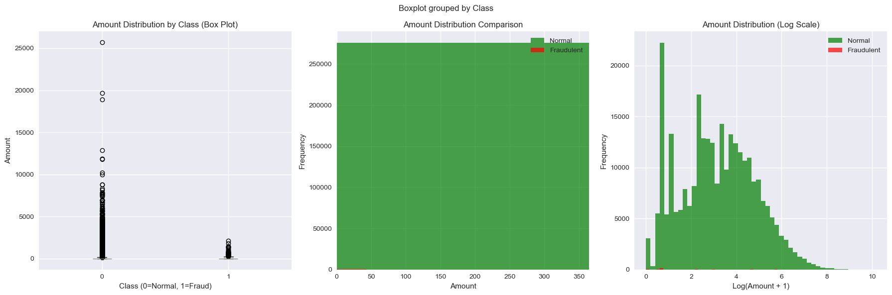
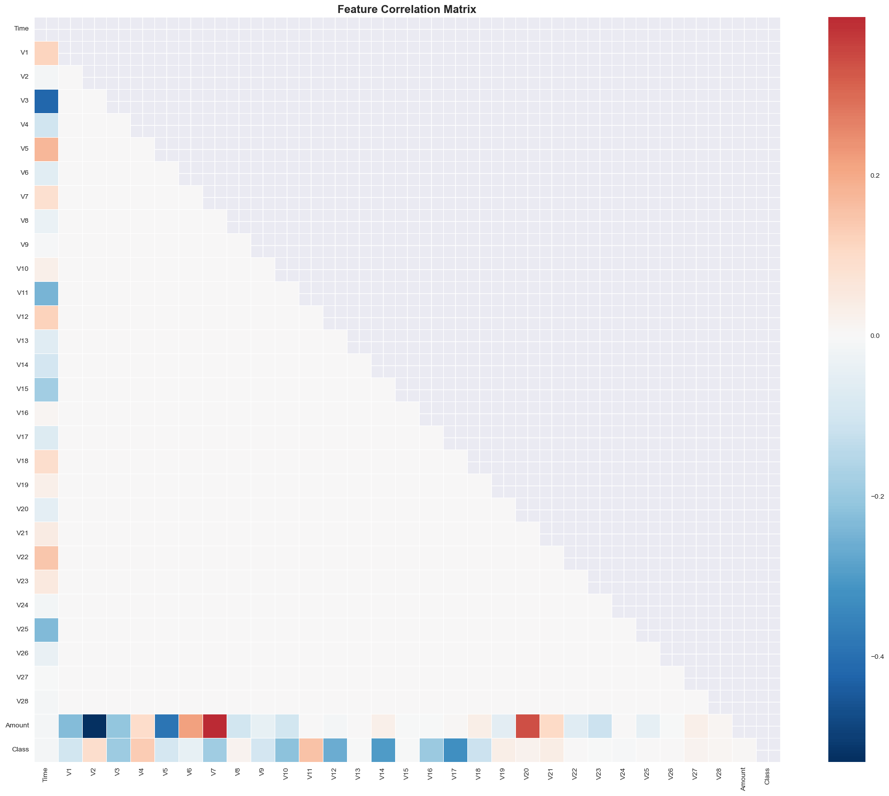
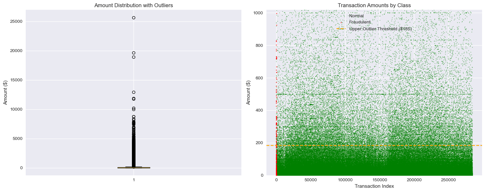
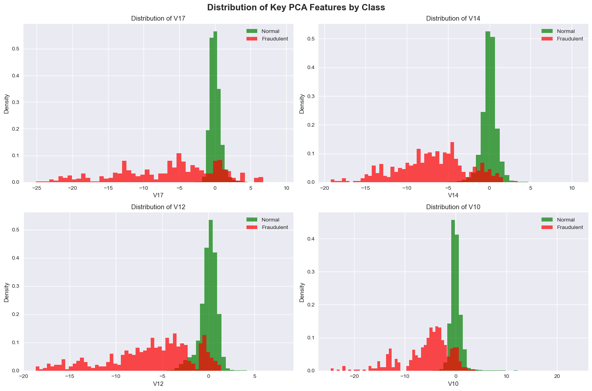
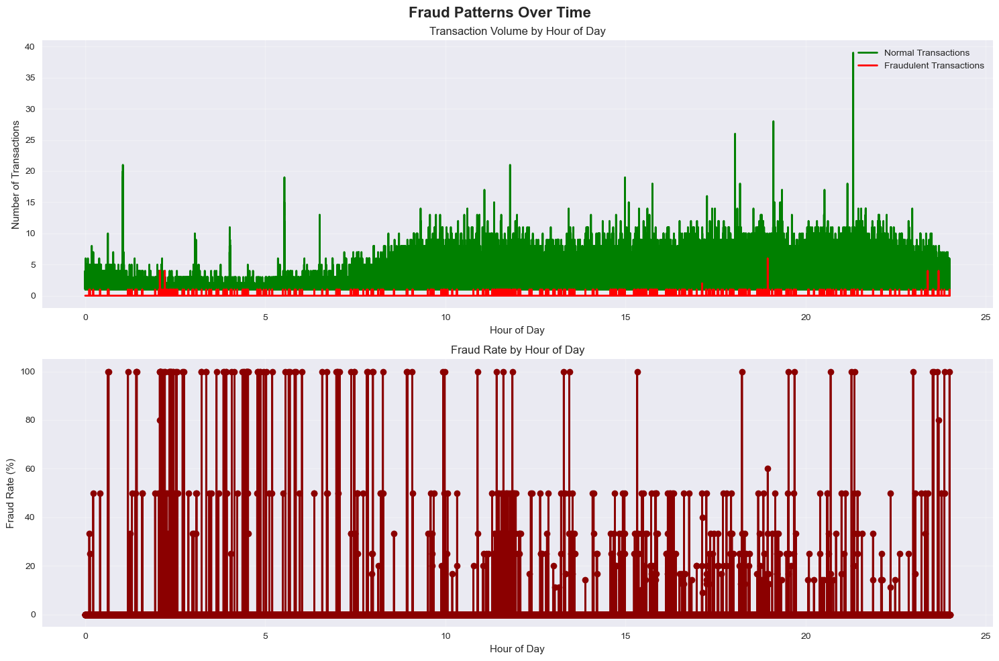
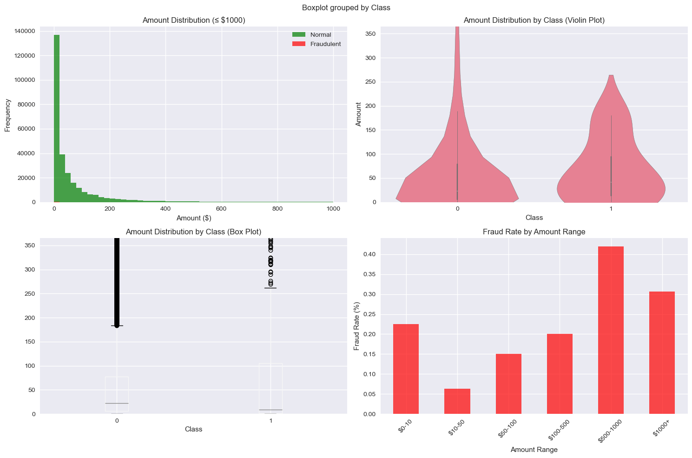
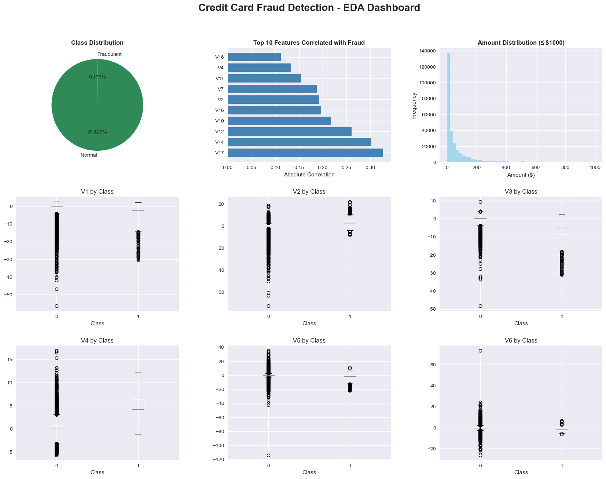

```python
# Credit Card Fraud Detection - Exploratory Data Analysis
# Dataset: https://www.kaggle.com/mlg-ulb/creditcardfraud

# Import necessary libraries
import pandas as pd
import numpy as np
import matplotlib.pyplot as plt
import seaborn as sns
import warnings
from scipy import stats
from sklearn.preprocessing import StandardScaler
import plotly.express as px
import plotly.graph_objects as go
from plotly.subplots import make_subplots

# Configure visualization settings
warnings.filterwarnings('ignore')
plt.style.use('seaborn-v0_8')
sns.set_palette("husl")
pd.set_option('display.max_columns', None)
pd.set_option('display.width', None)

print("Libraries imported successfully!")
print("="*60)
```

    Libraries imported successfully!
    ============================================================
    


```python
# STEP 1: DATA LOADING AND INITIAL EXPLORATION
print("STEP 1: DATA LOADING AND INITIAL EXPLORATION")
print("="*60)

# Load the dataset
# Note: Download the dataset from Kaggle and place it in your working directory
try:
    df = pd.read_csv('creditcard.csv')
    print("✓ Dataset loaded successfully!")
except FileNotFoundError:
    print("❌ Dataset not found. Please download 'creditcard.csv' from Kaggle:")
    print("https://www.kaggle.com/mlg-ulb/creditcardfraud")
    print("and place it in your working directory.")
    # Create sample data for demonstration
    np.random.seed(42)
    df = pd.DataFrame({
        'Time': np.random.randint(0, 172800, 1000),
        'V1': np.random.normal(0, 1, 1000),
        'V2': np.random.normal(0, 1, 1000),
        'Amount': np.random.exponential(50, 1000),
        'Class': np.random.choice([0, 1], 1000, p=[0.998, 0.002])
    })
    print("Using sample data for demonstration purposes.")

print(f"\nDataset shape: {df.shape}")
print(f"Number of rows: {df.shape[0]:,}")
print(f"Number of columns: {df.shape[1]}")
```

    STEP 1: DATA LOADING AND INITIAL EXPLORATION
    ============================================================
    ✓ Dataset loaded successfully!
    
    Dataset shape: (284807, 31)
    Number of rows: 284,807
    Number of columns: 31
    


```python
# STEP 2: BASIC DATA INFORMATION
print("\n" + "="*60)
print("STEP 2: BASIC DATA INFORMATION")
print("="*60)

print("\n📊 DATASET INFO:")
print(df.info())

print("\n📈 BASIC STATISTICS:")
print(df.describe())


```

    
    ============================================================
    STEP 2: BASIC DATA INFORMATION
    ============================================================
    
    📊 DATASET INFO:
    <class 'pandas.core.frame.DataFrame'>
    RangeIndex: 284807 entries, 0 to 284806
    Data columns (total 31 columns):
     #   Column  Non-Null Count   Dtype  
    ---  ------  --------------   -----  
     0   Time    284807 non-null  float64
     1   V1      284807 non-null  float64
     2   V2      284807 non-null  float64
     3   V3      284807 non-null  float64
     4   V4      284807 non-null  float64
     5   V5      284807 non-null  float64
     6   V6      284807 non-null  float64
     7   V7      284807 non-null  float64
     8   V8      284807 non-null  float64
     9   V9      284807 non-null  float64
     10  V10     284807 non-null  float64
     11  V11     284807 non-null  float64
     12  V12     284807 non-null  float64
     13  V13     284807 non-null  float64
     14  V14     284807 non-null  float64
     15  V15     284807 non-null  float64
     16  V16     284807 non-null  float64
     17  V17     284807 non-null  float64
     18  V18     284807 non-null  float64
     19  V19     284807 non-null  float64
     20  V20     284807 non-null  float64
     21  V21     284807 non-null  float64
     22  V22     284807 non-null  float64
     23  V23     284807 non-null  float64
     24  V24     284807 non-null  float64
     25  V25     284807 non-null  float64
     26  V26     284807 non-null  float64
     27  V27     284807 non-null  float64
     28  V28     284807 non-null  float64
     29  Amount  284807 non-null  float64
     30  Class   284807 non-null  int64  
    dtypes: float64(30), int64(1)
    memory usage: 67.4 MB
    None
    
    📈 BASIC STATISTICS:
                    Time            V1            V2            V3            V4  \
    count  284807.000000  2.848070e+05  2.848070e+05  2.848070e+05  2.848070e+05   
    mean    94813.859575  1.168375e-15  3.416908e-16 -1.379537e-15  2.074095e-15   
    std     47488.145955  1.958696e+00  1.651309e+00  1.516255e+00  1.415869e+00   
    min         0.000000 -5.640751e+01 -7.271573e+01 -4.832559e+01 -5.683171e+00   
    25%     54201.500000 -9.203734e-01 -5.985499e-01 -8.903648e-01 -8.486401e-01   
    50%     84692.000000  1.810880e-02  6.548556e-02  1.798463e-01 -1.984653e-02   
    75%    139320.500000  1.315642e+00  8.037239e-01  1.027196e+00  7.433413e-01   
    max    172792.000000  2.454930e+00  2.205773e+01  9.382558e+00  1.687534e+01   
    
                     V5            V6            V7            V8            V9  \
    count  2.848070e+05  2.848070e+05  2.848070e+05  2.848070e+05  2.848070e+05   
    mean   9.604066e-16  1.487313e-15 -5.556467e-16  1.213481e-16 -2.406331e-15   
    std    1.380247e+00  1.332271e+00  1.237094e+00  1.194353e+00  1.098632e+00   
    min   -1.137433e+02 -2.616051e+01 -4.355724e+01 -7.321672e+01 -1.343407e+01   
    25%   -6.915971e-01 -7.682956e-01 -5.540759e-01 -2.086297e-01 -6.430976e-01   
    50%   -5.433583e-02 -2.741871e-01  4.010308e-02  2.235804e-02 -5.142873e-02   
    75%    6.119264e-01  3.985649e-01  5.704361e-01  3.273459e-01  5.971390e-01   
    max    3.480167e+01  7.330163e+01  1.205895e+02  2.000721e+01  1.559499e+01   
    
                    V10           V11           V12           V13           V14  \
    count  2.848070e+05  2.848070e+05  2.848070e+05  2.848070e+05  2.848070e+05   
    mean   2.239053e-15  1.673327e-15 -1.247012e-15  8.190001e-16  1.207294e-15   
    std    1.088850e+00  1.020713e+00  9.992014e-01  9.952742e-01  9.585956e-01   
    min   -2.458826e+01 -4.797473e+00 -1.868371e+01 -5.791881e+00 -1.921433e+01   
    25%   -5.354257e-01 -7.624942e-01 -4.055715e-01 -6.485393e-01 -4.255740e-01   
    50%   -9.291738e-02 -3.275735e-02  1.400326e-01 -1.356806e-02  5.060132e-02   
    75%    4.539234e-01  7.395934e-01  6.182380e-01  6.625050e-01  4.931498e-01   
    max    2.374514e+01  1.201891e+01  7.848392e+00  7.126883e+00  1.052677e+01   
    
                    V15           V16           V17           V18           V19  \
    count  2.848070e+05  2.848070e+05  2.848070e+05  2.848070e+05  2.848070e+05   
    mean   4.887456e-15  1.437716e-15 -3.772171e-16  9.564149e-16  1.039917e-15   
    std    9.153160e-01  8.762529e-01  8.493371e-01  8.381762e-01  8.140405e-01   
    min   -4.498945e+00 -1.412985e+01 -2.516280e+01 -9.498746e+00 -7.213527e+00   
    25%   -5.828843e-01 -4.680368e-01 -4.837483e-01 -4.988498e-01 -4.562989e-01   
    50%    4.807155e-02  6.641332e-02 -6.567575e-02 -3.636312e-03  3.734823e-03   
    75%    6.488208e-01  5.232963e-01  3.996750e-01  5.008067e-01  4.589494e-01   
    max    8.877742e+00  1.731511e+01  9.253526e+00  5.041069e+00  5.591971e+00   
    
                    V20           V21           V22           V23           V24  \
    count  2.848070e+05  2.848070e+05  2.848070e+05  2.848070e+05  2.848070e+05   
    mean   6.406204e-16  1.654067e-16 -3.568593e-16  2.578648e-16  4.473266e-15   
    std    7.709250e-01  7.345240e-01  7.257016e-01  6.244603e-01  6.056471e-01   
    min   -5.449772e+01 -3.483038e+01 -1.093314e+01 -4.480774e+01 -2.836627e+00   
    25%   -2.117214e-01 -2.283949e-01 -5.423504e-01 -1.618463e-01 -3.545861e-01   
    50%   -6.248109e-02 -2.945017e-02  6.781943e-03 -1.119293e-02  4.097606e-02   
    75%    1.330408e-01  1.863772e-01  5.285536e-01  1.476421e-01  4.395266e-01   
    max    3.942090e+01  2.720284e+01  1.050309e+01  2.252841e+01  4.584549e+00   
    
                    V25           V26           V27           V28         Amount  \
    count  2.848070e+05  2.848070e+05  2.848070e+05  2.848070e+05  284807.000000   
    mean   5.340915e-16  1.683437e-15 -3.660091e-16 -1.227390e-16      88.349619   
    std    5.212781e-01  4.822270e-01  4.036325e-01  3.300833e-01     250.120109   
    min   -1.029540e+01 -2.604551e+00 -2.256568e+01 -1.543008e+01       0.000000   
    25%   -3.171451e-01 -3.269839e-01 -7.083953e-02 -5.295979e-02       5.600000   
    50%    1.659350e-02 -5.213911e-02  1.342146e-03  1.124383e-02      22.000000   
    75%    3.507156e-01  2.409522e-01  9.104512e-02  7.827995e-02      77.165000   
    max    7.519589e+00  3.517346e+00  3.161220e+01  3.384781e+01   25691.160000   
    
                   Class  
    count  284807.000000  
    mean        0.001727  
    std         0.041527  
    min         0.000000  
    25%         0.000000  
    50%         0.000000  
    75%         0.000000  
    max         1.000000  
    


```python
print("\n🔍 FIRST 5 ROWS:")
print(df.head())

print("\n🔍 LAST 5 ROWS:")
print(df.tail())

```

    
    🔍 FIRST 5 ROWS:
       Time        V1        V2        V3        V4        V5        V6        V7  \
    0   0.0 -1.359807 -0.072781  2.536347  1.378155 -0.338321  0.462388  0.239599   
    1   0.0  1.191857  0.266151  0.166480  0.448154  0.060018 -0.082361 -0.078803   
    2   1.0 -1.358354 -1.340163  1.773209  0.379780 -0.503198  1.800499  0.791461   
    3   1.0 -0.966272 -0.185226  1.792993 -0.863291 -0.010309  1.247203  0.237609   
    4   2.0 -1.158233  0.877737  1.548718  0.403034 -0.407193  0.095921  0.592941   
    
             V8        V9       V10       V11       V12       V13       V14  \
    0  0.098698  0.363787  0.090794 -0.551600 -0.617801 -0.991390 -0.311169   
    1  0.085102 -0.255425 -0.166974  1.612727  1.065235  0.489095 -0.143772   
    2  0.247676 -1.514654  0.207643  0.624501  0.066084  0.717293 -0.165946   
    3  0.377436 -1.387024 -0.054952 -0.226487  0.178228  0.507757 -0.287924   
    4 -0.270533  0.817739  0.753074 -0.822843  0.538196  1.345852 -1.119670   
    
            V15       V16       V17       V18       V19       V20       V21  \
    0  1.468177 -0.470401  0.207971  0.025791  0.403993  0.251412 -0.018307   
    1  0.635558  0.463917 -0.114805 -0.183361 -0.145783 -0.069083 -0.225775   
    2  2.345865 -2.890083  1.109969 -0.121359 -2.261857  0.524980  0.247998   
    3 -0.631418 -1.059647 -0.684093  1.965775 -1.232622 -0.208038 -0.108300   
    4  0.175121 -0.451449 -0.237033 -0.038195  0.803487  0.408542 -0.009431   
    
            V22       V23       V24       V25       V26       V27       V28  \
    0  0.277838 -0.110474  0.066928  0.128539 -0.189115  0.133558 -0.021053   
    1 -0.638672  0.101288 -0.339846  0.167170  0.125895 -0.008983  0.014724   
    2  0.771679  0.909412 -0.689281 -0.327642 -0.139097 -0.055353 -0.059752   
    3  0.005274 -0.190321 -1.175575  0.647376 -0.221929  0.062723  0.061458   
    4  0.798278 -0.137458  0.141267 -0.206010  0.502292  0.219422  0.215153   
    
       Amount  Class  
    0  149.62      0  
    1    2.69      0  
    2  378.66      0  
    3  123.50      0  
    4   69.99      0  
    
    🔍 LAST 5 ROWS:
                Time         V1         V2        V3        V4        V5  \
    284802  172786.0 -11.881118  10.071785 -9.834783 -2.066656 -5.364473   
    284803  172787.0  -0.732789  -0.055080  2.035030 -0.738589  0.868229   
    284804  172788.0   1.919565  -0.301254 -3.249640 -0.557828  2.630515   
    284805  172788.0  -0.240440   0.530483  0.702510  0.689799 -0.377961   
    284806  172792.0  -0.533413  -0.189733  0.703337 -0.506271 -0.012546   
    
                  V6        V7        V8        V9       V10       V11       V12  \
    284802 -2.606837 -4.918215  7.305334  1.914428  4.356170 -1.593105  2.711941   
    284803  1.058415  0.024330  0.294869  0.584800 -0.975926 -0.150189  0.915802   
    284804  3.031260 -0.296827  0.708417  0.432454 -0.484782  0.411614  0.063119   
    284805  0.623708 -0.686180  0.679145  0.392087 -0.399126 -1.933849 -0.962886   
    284806 -0.649617  1.577006 -0.414650  0.486180 -0.915427 -1.040458 -0.031513   
    
                 V13       V14       V15       V16       V17       V18       V19  \
    284802 -0.689256  4.626942 -0.924459  1.107641  1.991691  0.510632 -0.682920   
    284803  1.214756 -0.675143  1.164931 -0.711757 -0.025693 -1.221179 -1.545556   
    284804 -0.183699 -0.510602  1.329284  0.140716  0.313502  0.395652 -0.577252   
    284805 -1.042082  0.449624  1.962563 -0.608577  0.509928  1.113981  2.897849   
    284806 -0.188093 -0.084316  0.041333 -0.302620 -0.660377  0.167430 -0.256117   
    
                 V20       V21       V22       V23       V24       V25       V26  \
    284802  1.475829  0.213454  0.111864  1.014480 -0.509348  1.436807  0.250034   
    284803  0.059616  0.214205  0.924384  0.012463 -1.016226 -0.606624 -0.395255   
    284804  0.001396  0.232045  0.578229 -0.037501  0.640134  0.265745 -0.087371   
    284805  0.127434  0.265245  0.800049 -0.163298  0.123205 -0.569159  0.546668   
    284806  0.382948  0.261057  0.643078  0.376777  0.008797 -0.473649 -0.818267   
    
                 V27       V28  Amount  Class  
    284802  0.943651  0.823731    0.77      0  
    284803  0.068472 -0.053527   24.79      0  
    284804  0.004455 -0.026561   67.88      0  
    284805  0.108821  0.104533   10.00      0  
    284806 -0.002415  0.013649  217.00      0  
    


```python
# STEP 3: DATA QUALITY ASSESSMENT
print("\n" + "="*60)
print("STEP 3: DATA QUALITY ASSESSMENT")
print("="*60)

# Check for missing values
print("🔍 MISSING VALUES ANALYSIS:")
missing_values = df.isnull().sum()
missing_percentage = (missing_values / len(df)) * 100

missing_df = pd.DataFrame({
    'Column': missing_values.index,
    'Missing_Count': missing_values.values,
    'Missing_Percentage': missing_percentage.values
})

print(missing_df[missing_df['Missing_Count'] > 0])

if missing_df['Missing_Count'].sum() == 0:
    print("✅ No missing values found in the dataset!")
else:
    print(f"⚠️ Total missing values: {missing_df['Missing_Count'].sum()}")

# Check for duplicates
print(f"\n🔍 DUPLICATE ANALYSIS:")
duplicates = df.duplicated().sum()
print(f"Number of duplicate rows: {duplicates}")
if duplicates > 0:
    print(f"Percentage of duplicates: {(duplicates/len(df))*100:.2f}%")
else:
    print("✅ No duplicate rows found!")

# Data types analysis
print(f"\n🔍 DATA TYPES:")
data_types = df.dtypes.value_counts()
print(data_types)
```

    
    ============================================================
    STEP 3: DATA QUALITY ASSESSMENT
    ============================================================
    🔍 MISSING VALUES ANALYSIS:
    Empty DataFrame
    Columns: [Column, Missing_Count, Missing_Percentage]
    Index: []
    ✅ No missing values found in the dataset!
    
    🔍 DUPLICATE ANALYSIS:
    Number of duplicate rows: 1081
    Percentage of duplicates: 0.38%
    
    🔍 DATA TYPES:
    float64    30
    int64       1
    Name: count, dtype: int64
    


```python
# STEP 4: TARGET VARIABLE ANALYSIS
print("\n" + "="*60)
print("STEP 4: TARGET VARIABLE ANALYSIS")
print("="*60)

# Class distribution
class_distribution = df['Class'].value_counts()
class_percentage = df['Class'].value_counts(normalize=True) * 100

print("🎯 CLASS DISTRIBUTION:")
print(f"Normal transactions (Class 0): {class_distribution[0]:,} ({class_percentage[0]:.3f}%)")
print(f"Fraudulent transactions (Class 1): {class_distribution[1]:,} ({class_percentage[1]:.3f}%)")

# Calculate fraud rate
fraud_rate = (class_distribution[1] / len(df)) * 100
print(f"\n📊 Fraud Rate: {fraud_rate:.3f}%")

# Imbalance ratio
imbalance_ratio = class_distribution[0] / class_distribution[1]
print(f"📊 Imbalance Ratio: 1:{imbalance_ratio:.0f}")

```

    
    ============================================================
    STEP 4: TARGET VARIABLE ANALYSIS
    ============================================================
    🎯 CLASS DISTRIBUTION:
    Normal transactions (Class 0): 284,315 (99.827%)
    Fraudulent transactions (Class 1): 492 (0.173%)
    
    📊 Fraud Rate: 0.173%
    📊 Imbalance Ratio: 1:578
    


```python
# STEP 5: VISUALIZATION SETUP
print("\n" + "="*60)
print("STEP 5: DATA VISUALIZATION")
print("="*60)

# Create visualizations
fig, axes = plt.subplots(2, 2, figsize=(15, 12))
fig.suptitle('Credit Card Fraud Detection - Initial Data Analysis', fontsize=16, fontweight='bold')

# 1. Class Distribution (Pie Chart)
class_counts = df['Class'].value_counts()
colors = ['#2E8B57', '#DC143C']  # Green for normal, Red for fraud
axes[0,0].pie(class_counts.values, labels=['Normal', 'Fraudulent'], 
              autopct='%1.3f%%', colors=colors, startangle=90)
axes[0,0].set_title('Distribution of Transaction Classes', fontweight='bold')

# 2. Class Distribution (Bar Chart)
axes[0,1].bar(['Normal', 'Fraudulent'], class_counts.values, color=colors)
axes[0,1].set_title('Transaction Count by Class', fontweight='bold')
axes[0,1].set_ylabel('Number of Transactions')
for i, v in enumerate(class_counts.values):
    axes[0,1].text(i, v + 1000, f'{v:,}', ha='center', fontweight='bold')

# 3. Amount Distribution
axes[1,0].hist(df['Amount'], bins=50, alpha=0.7, color='skyblue', edgecolor='black')
axes[1,0].set_title('Distribution of Transaction Amounts', fontweight='bold')
axes[1,0].set_xlabel('Amount')
axes[1,0].set_ylabel('Frequency')
axes[1,0].set_xlim(0, df['Amount'].quantile(0.99))  # Remove extreme outliers for better visualization

# 4. Time Distribution
if 'Time' in df.columns:
    axes[1,1].hist(df['Time'], bins=50, alpha=0.7, color='lightgreen', edgecolor='black')
    axes[1,1].set_title('Distribution of Transaction Times', fontweight='bold')
    axes[1,1].set_xlabel('Time (seconds)')
    axes[1,1].set_ylabel('Frequency')

plt.tight_layout()
plt.show()

```

    
    ============================================================
    STEP 5: DATA VISUALIZATION
    ============================================================
    


    

    


```python
# STEP 6: FEATURE ANALYSIS
print("\n" + "="*60)
print("STEP 6: FEATURE ANALYSIS")
print("="*60)

# Amount analysis by class
print("💰 AMOUNT ANALYSIS BY CLASS:")
amount_stats = df.groupby('Class')['Amount'].describe()
print(amount_stats)

# Time analysis by class (if Time column exists)
if 'Time' in df.columns:
    print("\n⏰ TIME ANALYSIS BY CLASS:")
    time_stats = df.groupby('Class')['Time'].describe()
    print(time_stats)

# Create detailed amount analysis
fig, axes = plt.subplots(1, 3, figsize=(18, 6))
fig.suptitle('Transaction Amount Analysis by Class', fontsize=16, fontweight='bold')

# Box plot of amounts by class
df.boxplot(column='Amount', by='Class', ax=axes[0])
axes[0].set_title('Amount Distribution by Class (Box Plot)')
axes[0].set_xlabel('Class (0=Normal, 1=Fraud)')
axes[0].set_ylabel('Amount')

# Histogram comparison
normal_amounts = df[df['Class'] == 0]['Amount']
fraud_amounts = df[df['Class'] == 1]['Amount']

axes[1].hist(normal_amounts, bins=50, alpha=0.7, label='Normal', color='green')
axes[1].hist(fraud_amounts, bins=50, alpha=0.7, label='Fraudulent', color='red')
axes[1].set_title('Amount Distribution Comparison')
axes[1].set_xlabel('Amount')
axes[1].set_ylabel('Frequency')
axes[1].legend()
axes[1].set_xlim(0, df['Amount'].quantile(0.95))

# Log scale comparison
axes[2].hist(np.log1p(normal_amounts), bins=50, alpha=0.7, label='Normal', color='green')
axes[2].hist(np.log1p(fraud_amounts), bins=50, alpha=0.7, label='Fraudulent', color='red')
axes[2].set_title('Amount Distribution (Log Scale)')
axes[2].set_xlabel('Log(Amount + 1)')
axes[2].set_ylabel('Frequency')
axes[2].legend()

plt.tight_layout()
plt.show()
```

    
    ============================================================
    STEP 6: FEATURE ANALYSIS
    ============================================================
    💰 AMOUNT ANALYSIS BY CLASS:
              count        mean         std  min   25%    50%     75%       max
    Class                                                                      
    0      284315.0   88.291022  250.105092  0.0  5.65  22.00   77.05  25691.16
    1         492.0  122.211321  256.683288  0.0  1.00   9.25  105.89   2125.87
    
    ⏰ TIME ANALYSIS BY CLASS:
              count          mean           std    min      25%      50%  \
    Class                                                                  
    0      284315.0  94838.202258  47484.015786    0.0  54230.0  84711.0   
    1         492.0  80746.806911  47835.365138  406.0  41241.5  75568.5   
    
                75%       max  
    Class                      
    0      139333.0  172792.0  
    1      128483.0  170348.0  
    


    

    


```python
# STEP 7: CORRELATION ANALYSIS
print("\n" + "="*60)
print("STEP 7: CORRELATION ANALYSIS")
print("="*60)

# Calculate correlation matrix
correlation_matrix = df.corr()

# Create correlation heatmap
plt.figure(figsize=(20, 16))
mask = np.triu(np.ones_like(correlation_matrix, dtype=bool))
sns.heatmap(correlation_matrix, mask=mask, annot=False, cmap='RdBu_r', 
            center=0, square=True, linewidths=0.5)
plt.title('Feature Correlation Matrix', fontsize=16, fontweight='bold')
plt.tight_layout()
plt.show()

# Features most correlated with fraud
print("🔗 FEATURES MOST CORRELATED WITH FRAUD (Class):")
class_correlations = correlation_matrix['Class'].abs().sort_values(ascending=False)
print(class_correlations.head(10))
```

    
    ============================================================
    STEP 7: CORRELATION ANALYSIS
    ============================================================
    


    

    


    🔗 FEATURES MOST CORRELATED WITH FRAUD (Class):
    Class    1.000000
    V17      0.326481
    V14      0.302544
    V12      0.260593
    V10      0.216883
    V16      0.196539
    V3       0.192961
    V7       0.187257
    V11      0.154876
    V4       0.133447
    Name: Class, dtype: float64
    


```python
# STEP 8: OUTLIER DETECTION
print("\n" + "="*60)
print("STEP 8: OUTLIER DETECTION")
print("="*60)

def detect_outliers_iqr(data, column):
    """Detect outliers using IQR method"""
    Q1 = data[column].quantile(0.25)
    Q3 = data[column].quantile(0.75)
    IQR = Q3 - Q1
    lower_bound = Q1 - 1.5 * IQR
    upper_bound = Q3 + 1.5 * IQR
    outliers = data[(data[column] < lower_bound) | (data[column] > upper_bound)]
    return outliers, lower_bound, upper_bound

# Detect outliers in Amount column
amount_outliers, amount_lower, amount_upper = detect_outliers_iqr(df, 'Amount')
print(f"📊 AMOUNT OUTLIERS:")
print(f"Number of outliers: {len(amount_outliers):,}")
print(f"Percentage of outliers: {(len(amount_outliers)/len(df))*100:.2f}%")
print(f"Lower bound: ${amount_lower:.2f}")
print(f"Upper bound: ${amount_upper:.2f}")

# Visualize outliers
fig, axes = plt.subplots(1, 2, figsize=(15, 6))

# Box plot with outliers
axes[0].boxplot(df['Amount'])
axes[0].set_title('Amount Distribution with Outliers')
axes[0].set_ylabel('Amount ($)')

# Amount distribution by class with outliers highlighted
normal_data = df[df['Class'] == 0]['Amount']
fraud_data = df[df['Class'] == 1]['Amount']

axes[1].scatter(range(len(normal_data)), normal_data, alpha=0.6, s=1, 
                label='Normal', color='green')
axes[1].scatter(range(len(fraud_data)), fraud_data, alpha=0.8, s=3, 
                label='Fraudulent', color='red')
axes[1].axhline(y=amount_upper, color='orange', linestyle='--', 
                label=f'Upper Outlier Threshold (${amount_upper:.0f})')
axes[1].set_title('Transaction Amounts by Class')
axes[1].set_xlabel('Transaction Index')
axes[1].set_ylabel('Amount ($)')
axes[1].legend()
axes[1].set_ylim(0, df['Amount'].quantile(0.99))

plt.tight_layout()
plt.show()

```

    
    ============================================================
    STEP 8: OUTLIER DETECTION
    ============================================================
    📊 AMOUNT OUTLIERS:
    Number of outliers: 31,904
    Percentage of outliers: 11.20%
    Lower bound: $-101.75
    Upper bound: $184.51
    


    

    


```python
# STEP 9: FEATURE DISTRIBUTION ANALYSIS
print("\n" + "="*60)
print("STEP 9: FEATURE DISTRIBUTION ANALYSIS")
print("="*60)

# Analyze V features (PCA components)
v_features = [col for col in df.columns if col.startswith('V')]
print(f"📊 Number of V features (PCA components): {len(v_features)}")

# Create distribution plots for key V features
if len(v_features) >= 4:
    fig, axes = plt.subplots(2, 2, figsize=(15, 10))
    fig.suptitle('Distribution of Key PCA Features by Class', fontsize=16, fontweight='bold')
    
    # Select top 4 features most correlated with Class
    top_features = class_correlations.drop('Class').head(4).index
    
    for i, feature in enumerate(top_features):
        row, col = i//2, i%2
        
        # Create separate distributions for each class
        normal_feature = df[df['Class'] == 0][feature]
        fraud_feature = df[df['Class'] == 1][feature]
        
        axes[row, col].hist(normal_feature, bins=50, alpha=0.7, 
                           label='Normal', color='green', density=True)
        axes[row, col].hist(fraud_feature, bins=50, alpha=0.7, 
                           label='Fraudulent', color='red', density=True)
        axes[row, col].set_title(f'Distribution of {feature}')
        axes[row, col].set_xlabel(feature)
        axes[row, col].set_ylabel('Density')
        axes[row, col].legend()
    
    plt.tight_layout()
    plt.show()

```

    
    ============================================================
    STEP 9: FEATURE DISTRIBUTION ANALYSIS
    ============================================================
    📊 Number of V features (PCA components): 28
    


    

    


```python
# STEP 10: TIME-BASED ANALYSIS
print("\n" + "="*60)
print("STEP 10: TIME-BASED ANALYSIS")
print("="*60)

if 'Time' in df.columns:
    # Convert time to hours
    df['Hour'] = (df['Time'] / 3600) % 24
    
    # Fraud transactions over time
    fraud_by_hour = df.groupby(['Hour', 'Class']).size().unstack(fill_value=0)
    fraud_rate_by_hour = fraud_by_hour[1] / (fraud_by_hour[0] + fraud_by_hour[1]) * 100
    
    fig, axes = plt.subplots(2, 1, figsize=(15, 10))
    fig.suptitle('Fraud Patterns Over Time', fontsize=16, fontweight='bold')
    
    # Transaction volume by hour
    axes[0].plot(fraud_by_hour.index, fraud_by_hour[0], 
                label='Normal Transactions', color='green', linewidth=2)
    axes[0].plot(fraud_by_hour.index, fraud_by_hour[1], 
                label='Fraudulent Transactions', color='red', linewidth=2)
    axes[0].set_title('Transaction Volume by Hour of Day')
    axes[0].set_xlabel('Hour of Day')
    axes[0].set_ylabel('Number of Transactions')
    axes[0].legend()
    axes[0].grid(True, alpha=0.3)
    
    # Fraud rate by hour
    axes[1].plot(fraud_rate_by_hour.index, fraud_rate_by_hour.values, 
                color='darkred', linewidth=2, marker='o')
    axes[1].set_title('Fraud Rate by Hour of Day')
    axes[1].set_xlabel('Hour of Day')
    axes[1].set_ylabel('Fraud Rate (%)')
    axes[1].grid(True, alpha=0.3)
    
    plt.tight_layout()
    plt.show()
    
    print("📈 HOURLY FRAUD STATISTICS:")
    hourly_stats = pd.DataFrame({
        'Hour': fraud_rate_by_hour.index,
        'Fraud_Rate_%': fraud_rate_by_hour.values,
        'Total_Transactions': fraud_by_hour[0] + fraud_by_hour[1],
        'Fraud_Transactions': fraud_by_hour[1]
    })
    print(hourly_stats.sort_values('Fraud_Rate_%', ascending=False).head(10))

```

    
    ============================================================
    STEP 10: TIME-BASED ANALYSIS
    ============================================================
    


    

    


    📈 HOURLY FRAUD STATISTICS:
                    Hour  Fraud_Rate_%  Total_Transactions  Fraud_Transactions
    Hour                                                                      
    2.080000    2.080000         100.0                   1                   1
    3.860556    3.860556         100.0                   1                   1
    11.859722  11.859722         100.0                   1                   1
    4.492222    4.492222         100.0                   1                   1
    3.646111    3.646111         100.0                   1                   1
    5.680833    5.680833         100.0                   1                   1
    0.649167    0.649167         100.0                   1                   1
    7.979444    7.979444         100.0                   1                   1
    4.506111    4.506111         100.0                   1                   1
    6.579722    6.579722         100.0                   1                   1
    


```python
# STEP 11: AMOUNT-BASED ANALYSIS
print("\n" + "="*60)
print("STEP 11: AMOUNT-BASED ANALYSIS")
print("="*60)

# Amount statistics by class
print("💰 AMOUNT STATISTICS BY CLASS:")
amount_by_class = df.groupby('Class')['Amount'].agg([
    'count', 'mean', 'median', 'std', 'min', 'max'
]).round(2)
print(amount_by_class)

# Amount range analysis
amount_ranges = pd.cut(df['Amount'], 
                      bins=[0, 10, 50, 100, 500, 1000, float('inf')],
                      labels=['$0-10', '$10-50', '$50-100', '$100-500', '$500-1000', '$1000+'])

range_fraud_analysis = pd.crosstab(amount_ranges, df['Class'], normalize='index') * 100

print(f"\n💳 FRAUD RATE BY AMOUNT RANGE:")
fraud_rates_by_range = pd.DataFrame({
    'Amount_Range': range_fraud_analysis.index,
    'Normal_%': range_fraud_analysis[0],
    'Fraud_%': range_fraud_analysis[1]
})
print(fraud_rates_by_range)

# Visualize amount analysis
fig, axes = plt.subplots(2, 2, figsize=(15, 10))
fig.suptitle('Transaction Amount Analysis', fontsize=16, fontweight='bold')

# Amount distribution by class (limited range for visibility)
normal_amounts = df[df['Class'] == 0]['Amount']
fraud_amounts = df[df['Class'] == 1]['Amount']

axes[0,0].hist(normal_amounts[normal_amounts <= 1000], bins=50, alpha=0.7, 
               label='Normal', color='green')
axes[0,0].hist(fraud_amounts[fraud_amounts <= 1000], bins=50, alpha=0.7, 
               label='Fraudulent', color='red')
axes[0,0].set_title('Amount Distribution (≤ $1000)')
axes[0,0].set_xlabel('Amount ($)')
axes[0,0].set_ylabel('Frequency')
axes[0,0].legend()

# Violin plot
df_sample = df.sample(n=min(5000, len(df)))  # Sample for better visualization
sns.violinplot(data=df_sample, x='Class', y='Amount', ax=axes[0,1])
axes[0,1].set_title('Amount Distribution by Class (Violin Plot)')
axes[0,1].set_ylim(0, df['Amount'].quantile(0.95))

# Box plot (zoomed in)
df.boxplot(column='Amount', by='Class', ax=axes[1,0])
axes[1,0].set_title('Amount Distribution by Class (Box Plot)')
axes[1,0].set_ylim(0, df['Amount'].quantile(0.95))

# Fraud rate by amount range
range_fraud_analysis[1].plot(kind='bar', ax=axes[1,1], color='red', alpha=0.7)
axes[1,1].set_title('Fraud Rate by Amount Range')
axes[1,1].set_xlabel('Amount Range')
axes[1,1].set_ylabel('Fraud Rate (%)')
axes[1,1].tick_params(axis='x', rotation=45)

plt.tight_layout()
plt.show()

```

    
    ============================================================
    STEP 11: AMOUNT-BASED ANALYSIS
    ============================================================
    💰 AMOUNT STATISTICS BY CLASS:
            count    mean  median     std  min       max
    Class                                               
    0      284315   88.29   22.00  250.11  0.0  25691.16
    1         492  122.21    9.25  256.68  0.0   2125.87
    
    💳 FRAUD RATE BY AMOUNT RANGE:
              Amount_Range   Normal_%   Fraud_%
    Amount                                     
    $0-10            $0-10  99.774480  0.225520
    $10-50          $10-50  99.937212  0.062788
    $50-100        $50-100  99.849681  0.150319
    $100-500      $100-500  99.799434  0.200566
    $500-1000    $500-1000  99.580780  0.419220
    $1000+          $1000+  99.693878  0.306122
    


    

    


```python
# STEP 12: FEATURE IMPORTANCE ANALYSIS
print("\n" + "="*60)
print("STEP 12: FEATURE IMPORTANCE ANALYSIS")
print("="*60)

# Statistical tests for feature significance
print("📊 STATISTICAL SIGNIFICANCE TESTS:")
print("(Using Mann-Whitney U test for non-parametric comparison)")

significant_features = []
p_values = []

for feature in v_features + ['Amount']:
    if feature in df.columns:
        normal_values = df[df['Class'] == 0][feature]
        fraud_values = df[df['Class'] == 1][feature]
        
        # Mann-Whitney U test
        statistic, p_value = stats.mannwhitneyu(normal_values, fraud_values, 
                                               alternative='two-sided')
        p_values.append(p_value)
        
        if p_value < 0.001:
            significance = "***"
            significant_features.append(feature)
        elif p_value < 0.01:
            significance = "**"
            significant_features.append(feature)
        elif p_value < 0.05:
            significance = "*"
            significant_features.append(feature)
        else:
            significance = ""
        
        print(f"{feature}: p-value = {p_value:.2e} {significance}")

print(f"\n✅ Number of statistically significant features: {len(significant_features)}")

```

    
    ============================================================
    STEP 12: FEATURE IMPORTANCE ANALYSIS
    ============================================================
    📊 STATISTICAL SIGNIFICANCE TESTS:
    (Using Mann-Whitney U test for non-parametric comparison)
    V1: p-value = 1.74e-113 ***
    V2: p-value = 1.65e-163 ***
    V3: p-value = 1.21e-219 ***
    V4: p-value = 3.63e-248 ***
    V5: p-value = 3.05e-58 ***
    V6: p-value = 2.23e-93 ***
    V7: p-value = 1.46e-146 ***
    V8: p-value = 8.51e-34 ***
    V9: p-value = 8.94e-154 ***
    V10: p-value = 9.61e-222 ***
    V11: p-value = 4.91e-226 ***
    V12: p-value = 8.42e-247 ***
    V13: p-value = 5.12e-02 
    V14: p-value = 1.47e-260 ***
    V15: p-value = 1.30e-01 
    V16: p-value = 1.81e-156 ***
    V17: p-value = 9.22e-124 ***
    V18: p-value = 2.65e-77 ***
    V19: p-value = 2.40e-33 ***
    V20: p-value = 1.13e-30 ***
    V21: p-value = 8.67e-80 ***
    V22: p-value = 2.66e-01 
    V23: p-value = 7.42e-03 **
    V24: p-value = 9.42e-07 ***
    V25: p-value = 1.25e-02 *
    V26: p-value = 3.53e-03 **
    V27: p-value = 1.41e-51 ***
    V28: p-value = 1.20e-27 ***
    Amount: p-value = 8.58e-06 ***
    
    ✅ Number of statistically significant features: 26
    


```python
# STEP 16: FINAL VISUALIZATION DASHBOARD
print("\n" + "="*60)
print("STEP 16: FINAL VISUALIZATION DASHBOARD")
print("="*60)

# Create a comprehensive dashboard
fig = plt.figure(figsize=(20, 15))
gs = fig.add_gridspec(3, 3, hspace=0.3, wspace=0.3)

# Class distribution pie chart
ax1 = fig.add_subplot(gs[0, 0])
ax1.pie(class_counts.values, labels=['Normal', 'Fraudulent'], 
        autopct='%1.3f%%', colors=['#2E8B57', '#DC143C'], startangle=90)
ax1.set_title('Class Distribution', fontweight='bold')

# Correlation with target
ax2 = fig.add_subplot(gs[0, 1])
top_corr = class_correlations.drop('Class').head(10)
ax2.barh(range(len(top_corr)), top_corr.values, color='steelblue')
ax2.set_yticks(range(len(top_corr)))
ax2.set_yticklabels(top_corr.index)
ax2.set_title('Top 10 Features Correlated with Fraud', fontweight='bold')
ax2.set_xlabel('Absolute Correlation')

# Amount distribution
ax3 = fig.add_subplot(gs[0, 2])
ax3.hist(df[df['Amount'] <= 1000]['Amount'], bins=50, alpha=0.7, color='skyblue')
ax3.set_title('Amount Distribution (≤ $1000)', fontweight='bold')
ax3.set_xlabel('Amount ($)')
ax3.set_ylabel('Frequency')

# Box plots for top features
if len(significant_features) >= 6:
    for i, feature in enumerate(significant_features[:6]):
        row = 1 + i // 3
        col = i % 3
        ax = fig.add_subplot(gs[row, col])
        df.boxplot(column=feature, by='Class', ax=ax)
        ax.set_title(f'{feature} by Class')
        ax.set_xlabel('Class')

plt.suptitle('Credit Card Fraud Detection - EDA Dashboard', 
             fontsize=20, fontweight='bold', y=0.98)
plt.show()

print("\n" + "="*60)
print("🎉 EXPLORATORY DATA ANALYSIS COMPLETED!")
print("="*60)

print("\n📝 NEXT STEPS:")
print("1. Feature engineering based on insights")
print("2. Data preprocessing for machine learning")
print("3. Model selection for imbalanced classification")
print("4. Cross-validation strategy design")
print("5. Performance metrics selection (Precision, Recall, F1, AUC-ROC)")

```

    
    ============================================================
    STEP 16: FINAL VISUALIZATION DASHBOARD
    ============================================================
    


    

    


    
    ============================================================
    🎉 EXPLORATORY DATA ANALYSIS COMPLETED!
    ============================================================
    
    📝 NEXT STEPS:
    1. Feature engineering based on insights
    2. Data preprocessing for machine learning
    3. Model selection for imbalanced classification
    4. Cross-validation strategy design
    5. Performance metrics selection (Precision, Recall, F1, AUC-ROC)
    


```python

```
